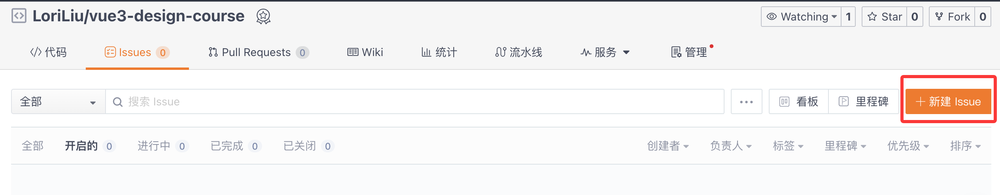

## 本次课程目标

### 目标 1： 学习在仓库中创建 issue

- 掌握 issue 的创建
- 掌握 issue 的关闭
  将项目功能需求拆解成一个一个的 issue 进行记录
- issue 可以是需求，可以是 bug

### 目标 2: 根据 issue 创建分支，并 merge 到主干分支

- 掌握使用 git 创建分支
- 掌握使用 git push 代码到分支
- 掌握使用 git merge 分支到主干分支
- 掌握 PR 的管理

## 交付物

- 新建一个 issue，并针对 issue 创建分支
- 将开发的 code push 到分支
- 通过 PR merge 分支到 main
- 可以在仓库中查看分支、PR 和 push 记录

## 创建 issue

1. 进入代码仓库
2. 点击页面中的 “Issue” 标签。
3. 点击 “新建 Issue” 按钮，此时会弹出一个对话框。
4. 在对话框中填写相关信息，包括 Issue 的标题、详细描述，还可根据需要选择指派给的成员、添加标签等。
5. 填写完成后，点击 “提交新 Issue” 按钮，即可完成创建。
   
   【示例】

- title：创建 login 页面，登录成功后跳转到系统首页
- description：

  - 登录页面包含一个表单，需要输入“用户名”和“密码”，点击“登录”按钮进行登录
  - 假设“用户名”为“admin”，“密码” 为 “123456”
  - 输入的用户名或者密码错误时，显示错误信息
  - 登录成功后跳转到系统首页
  - 页面使用 element-plus 组件来实现
  - UI 主题风格为粉紫色

- 选择责任人
- 选择优先级
- 提交

## 创建分支
